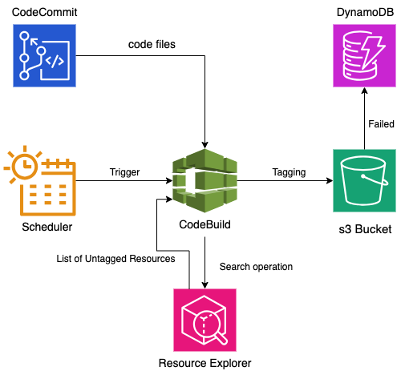

# CostCenter Autotagging in AWS

> ## Overview

This document outlines a technical solution for implementing CostCenter Autotagging within an AWS account. It is intended for developers, providing a detailed guide to replicate the solution for other resources.

## Architecture Diagram

## Solution Components

The solution utilizes several AWS services, including:

- **AWS CodeCommit**: Stores the `CostCenter_Autotag.py` and `Buildspec.yaml` files.
- **AWS CodeBuild**: Executes Autotagging using files from CodeCommit.
- **AWS Resource Explorer**: Retrieves a list of new resources lacking the CostCenter tag.
- **AWS DynamoDB**: Logs successfully tagged resources and any failures.
- **EventBridge Scheduler**: Triggers the CodeBuild Project on certain schedule

## Workflow

1. `EventBridge` Scheduler triggers the `CodeBuild` project
2. `CodeBuild` executes the `BuildSpec.yaml` file

**BuildSpec.yaml functionality**:

It has three distinct phases as mentioned below.

1. **PreBuild**: It attaches the Administrator Access policy to CodeBuild IAM Role
    > aws iam attach-role-policy --role-name $EXECUTION_ROLE_NAME  --policy-arn arn:aws:iam::aws:policy/AdministratorAccess
2. **Build**: It executes `CostCenter_Autotag.py` file
    > python CostCenter_Autotag.py
3. **PostBuild**: It revokes the Administrator Access policy from CodeBuild IAM Role
    > aws iam detach-role-policy --role-name $EXECUTION_ROLE_NAME --policy-arn arn:aws:iam::aws:policy/AdministratorAccess

**Note**: PostBuild Phase attempts to revoke the Administrator Access policy from the CodeBuild IAM Role regardless of the success or failures of the previous stages. 

**CostCenter_Autotag.py functionality**:

1. Retrieves a list of new resources from Resource Explorer, filtering for those missing the CostCenter tag.
2. Tags resources using the ResourceGroupTagging API.
3. Logs failures to a DynamoDB table.
4. Logs successfully tagged resources in the "global" region to another DynamoDB table.
5. Skips previously tagged resources and those not tagged due to earlier failures in subsequent runs.

**Note:** Skips are implemented to avoid attempting to tag resources that do not support tagging.

> ## Implementation Steps

> ### Resource Explorer

1.  **Enable Resource Indexing:**

    AWS Resource Explorer requires indexing of AWS resources for search functionality.

    - Navigate to the Resource Explorer dashboard and select “Enable resource indexing.”
    - Choose AWS Regions for indexing, recommended to include all with active resources (Avoid including regions that are not in use).
    - Confirm selections to initiate indexing, which varies in time based on resource types and quantity.

> ### CodeCommit Repository

1. **Create a new AWS CodeCommit repository:**

    - Visit the AWS CodeCommit console.
    - Choose Create repository on the Dashboard.
    - Provide a repository name and an optional description.
    - Click Create.

2. **Store the `CostCenter_Autotag.py` and `Buildspec.yaml` files:**

    You can use either AWS Management Console or Git CLI for uploading:

    - **AWS Management Console:** Use the "upload file" option to add files and commit changes.
    
    - **Git CLI:**
        1. Clone the repository: `git clone <repository URL>`.
        2. Move files to the cloned directory.
        3. Add files: `git add CostCenter_Autotag.py Buildspec.yaml`.
        4. Commit changes: `git commit -m "Add initial files"`.
        5. Push changes: `git push origin master`.

> ### CodeBuild Project

1. **Create a new CodeBuild Project:**

    - Open the AWS CodeBuild console.
    - Click Create build project.

2. **Project Configuration:**

    - Name: Assign a meaningful name.
    - Source: Choose CodeCommit, select the repository, select branch 'main'.

3. **Environment:**

    - Image: Choose "Managed image" with "Amazon Linux 2".
    - Runtime(s): Select "Standard" and the latest image version.
    - Service role: Confirm permissions.
    - Under Additional Configurations drop down menu, store the below environment variables
    
    > **Note**: Replace the below values with the relevant values of that account
        >
        TAG_KEY   : CostCenter
        TAG_VALUE : 100082 
        EXECUTION_ROLE_NAME : codebuild-Costcenter-Autotag-service-role

4. **Buildspec:**

    - Opt for "Use a buildspec file" for CodeBuild to utilize the buildspec.yml in your repository.

5. **Logs:**

    - Configure logging to Amazon CloudWatch or an Amazon S3 bucket.

6. **Create Build Project:**

    - Review settings and click "Create build project".

7. **Role Permissions:**

    - Ensure the CodeBuild project service role has `IAMFullAccess` AWS managed policy.
    
> ### EventBridge Scheduler

**The EventBridge Scheduler is set up to trigger CodeBuild project to build at certain intervals**

1. Navigate to EventBridge Scheduler and create a new schedule.

2. Fill out the name and all other relevant details.

3. Under Schedule Pattern, select "Recurring Schedule" option.

4. Select Cron based schedule and fill in the below cron expression, this cron is set to every SAT at 8 PM EST (make sure to select the correct time zone), keep the flexible time window to "OFF".

    > 00 20 ? * SAT *

5. Selct "StartBuild" of CodeBuild service as the target and the specific Autotagging codebuild project. 

6. The request parameters can be left empty.

7. Make the retry attemps to 3. (This can be increased or decreased based on the project)

8. Review and create the schedule.

**At this point, if all the above steps are implemented, the CodeBuild project will run on the specified schedule and perform Tagging operation on all the resources in that account.**
