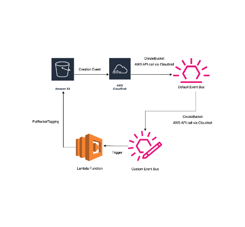

# Multi-Region AWS Services Auto-Tagging Infrastructure

## Overview

This documentation outlines the steps for setting up auto-tagging for AWS services created across multiple AWS regions. The solution utilizes AWS CloudTrail, AWS Lambda, AWS IAM Roles, and AWS EventBridge services to enable centralized logging and tagging of the infrastructure.

## Architecture Diagram

## Components

- **AWS CloudTrail**: Captures all API calls for creation events across all regions.
- **AWS Lambda**: Contains the Python code for tagging.
- **AWS IAM Role**: Manages permissions for the Lambda function to tag various resources.
- **Amazon EventBridge**: Routes multi-region creation events to the centralized Lambda function.

## Architecture

- **Multi-Region CloudTrail**: Set up to track multi-region creation events. Deployed in the central region (us-east-1).
- **Centralized Lambda Function**: This triggers upon specific creation events and tags the newly created resources.
- **IAM Role for Lambda**: Grants the lambda function necessary permissions to tag resources.
- **Custom Event Bridge Bus**: Setup to trigger the lambda function on creation event API calls.
- **EventBridge Rules**: Set up in each AWS region to detect and forward events to the Custom Event Bus.

## Procedures

### Step 1: Set Up Multi-Region CloudTrail

A new CloudTrail was created and configured to apply to all regions, ensuring that any creation event is captured.

- **CloudTrail**: BIFX-auto-tagging

### Step 2: Create Centralized Lambda Function

A Lambda function was created in a central AWS region (us-east-1). This function is responsible for tagging new resources based on the events received.

- **Lambda**: bifx-autotag-lambda

### Step 3: Configure IAM Role for Lambda

An IAM role with the necessary permissions was created to allow the Lambda function to tag S3 resources across different regions. The permission set provided is:

- **Permissions**:
  - AWSCloudTrail_ReadOnlyAccess
  - AWSLambdaBasicExecutionRole
  - Custom tagging policy

- **IAM Role**: allow-s3-access-to-quilt-role

### Step 4: Create a Custom Event Bus in the Central Region (us-east-1)

A custom event bus was configured in the central region, which accepts events forwarded from any event bus throughout any region in the account. This helps in mapping events forwarded from other regions to the central auto-tagging lambda function.

- **Configuration**:
  - A resource-based policy is attached to this custom event bus that accepts events from any event bus throughout the account.
  - A rule is configured in this bus that forwards all creation events captured on this bus to the central lambda function.
  
- **Event Pattern**:
  - Event Source: AWS Service
  - AWS Service: S3, EC2, RDS, Lambda, DynamoDB, ElasticFileSystem, ECS
  - Event Type Specification: Specific Operation(s) = All create events under the above services

- **Target**: Central lambda function (bifx-autotag-lambda)

### Step 5: Set Up EventBridge Rules to Route S3 Events from All Desired Regions

EventBridge rules were established in each AWS region on the default event bus to capture the S3 bucket creation events and forward them to the central event bus.

- **Event Pattern**:
  - Event Source: AWS Service
  - AWS Service: S3, EC2, RDS, Lambda, DynamoDB, ElasticFileSystem, ECS
  - Event Type Specification: Specific Operation(s) = All create events under the above services

- **Target**: Custom “central event bus”

### Step 6: Testing the Setup

The auto-tagging feature was verified by inspecting the “CreatedBy” tag of the newly created S3 bucket. CloudWatch Logs were monitored under the “bifx-autotag-lambda” log group to ensure that the Lambda function is triggered and executed without errors.

---

For more details, refer to the architecture diagram and additional configuration files included in this repository.

Hi Norbert, I am reaching out to just catch up, I am in the last stage of my Co-Op here at Alnylam and I would like to thank you for the initial support and encouragement you had provided me with during the initial days of my co-op at alnylam. Though we didn't get a chnace to work together for a longer time, I really enjoyed the few interactions we had. I recently had a chance to share my work and learnings durign the co-op period with the entire organisation via a poster presentation. I would love for you to have a look at it and provide your feedback. Also attached is a github repository link that explains a detailed overview of all the projects I completed here on my Co-op, I would be really thankful if you went through this 5 minute read article. 