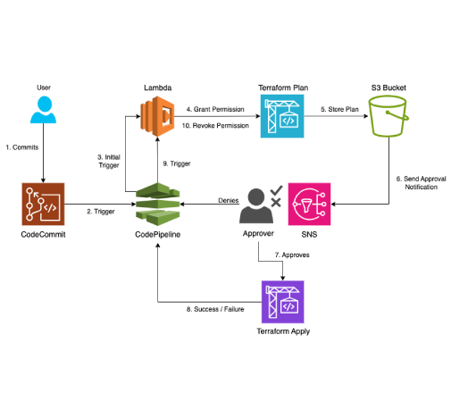

# CI/CD Pipeline for Quilt Releases

## Overview

This Continuous Integration and Continuous Deployment (CI/CD) pipeline is designed to automate the deployment process of Quilt releases. The pipeline is triggered by commits to the main branch of a repository hosted on AWS CodeCommit. It utilizes a suite of AWS services to ensure that changes are automatically built and deployed in a secure, efficient, and controlled manner.

## Architecture Diagram

## AWS Services Utilized

- **AWS CodeCommit**: Hosts the source code repository.
- **AWS CodePipeline**: Orchestrates the stages of the CI/CD process and calls relevant services.
- **AWS CodeBuild**: Executes terraform build and apply commands.
- **AWS Lambda**: Manages temporary IAM role grant/revoke permission action and sending SNS alerts.
- **Amazon S3**: Stores Terraform plan files.
- **Amazon Simple Notification Service (SNS)**: Sends notifications regarding the pipeline's status.
- **Docker Image**: Used as a preconfigured environment to execute the terraform commands.
- **Amazon Elastic Container Registry (ECR)**: Stores Docker images.
- **IAM Roles**: Manages AWS service permissions.

## Pipeline Stages and Actions

### 1. Source Stage

- **Trigger**: The pipeline is automatically triggered when a commit is made to the main branch of the CodeCommit repository.
- **Action**: CodePipeline retrieves the latest codebase for processing in subsequent stages.

### 2. Terraform Plan Stage

- **Pre-Approval Action (AWS Lambda)**: A Lambda function is invoked to grant the CodePipeline IAM role admin access. This is necessary for executing Terraform commands that interact with AWS resources.
- **Terraform Plan (AWS CodeBuild – TfPlan)**: Executes the terraform plan command to generate an execution plan, which is then stored in an Amazon S3 bucket for review. This plan outlines the changes that will be applied to the AWS environment.

### 3. Approval Stage

- **Manual Approval**: A manual approval step is incorporated to review the Terraform plan stored in S3. This step ensures oversight and control before changes are applied to the infrastructure.

### 4. Terraform Apply Stage

- **Terraform Apply (AWS CodeBuild – TfApply)**: Once the plan is approved, a second CodeBuild project executes the terraform apply command. It first retrieves the plan file from the S3 bucket and then applies the changes to the AWS environment as per the plan.

### 5. Post-Deployment Stage

- **Revoke Access (AWS Lambda)**: After the Terraform apply stage, a Lambda function is called to revoke the admin access previously granted to the CodePipeline IAM role. This ensures the principle of least privilege is adhered to, minimizing security risks.

## Notifications

Throughout the pipeline execution, AWS SNS is used to send notifications regarding the status of the deployment process. This keeps stakeholders informed and enables quick responses to any issues.

## CodeBuild Projects

AWS CodeBuild projects are used to automate the infrastructure deployment process using Terraform. They are called at two distinct stages within the pipeline—Terraform Plan and Terraform Apply—each triggered by respective buildspec files. Additionally, a Docker container environment is used for executing these stages, ensuring a consistent and controlled execution environment.

## Build Specifications

### Terraform Plan Stage (buildspec.yml)

This stage is initiated post the initial approval stage that grants Admin access to the pipeline’s IAM role, triggering the pipeline's execution. It is responsible for generating and reviewing a Terraform execution plan.

**Phases**:
- **Install**: Updates the container's package index and installs necessary tools, including unzip and wget. It checks for the specified version of Terraform (1.1.0) and installs it if not present.
- **Pre-Build**: Initializes Terraform to prepare for plan generation.
- **Build**: Executes terraform plan, outputting a human-readable plan to plan-output.txt and a binary plan to tfplan. These files are then uploaded to an S3 bucket for review and subsequent use.
- **Post-Build**: Outputs a completion message indicating the successful generation and upload of the Terraform plan.

### Terraform Apply Stage (postApprovalBuildSpec.yml)

Following manual approval of the Terraform plan, this stage applies the plan to the AWS environment, actualizing the infrastructure changes.

**Phases**:
- **Install**: Mirrors the Plan stage's install phase, ensuring Terraform is at the correct version.
- **Pre-Build**: Retrieves the approved tfplan from the S3 bucket and initializes Terraform.
- **Build**: Applies the Terraform plan without requiring further approval, effectuating the infrastructure modifications.
- **Post-Build**: Outputs a completion message signaling the successful application of the Terraform plan.

### Docker Environment Configuration (Dockerfile)

The execution environment for both stages is a Docker container built from an official Ubuntu 20.04 image, customized to include necessary dependencies for Terraform operations and AWS interactions.

**Configuration Details**:
- **Base Image**: Ubuntu 20.04 chosen for its stability and compatibility.
- **Packages**: Installs wget, unzip, curl, AWS CLI (version 2), and other dependencies essential for the build processes.
- **Terraform Installation**: Embeds the specified version of Terraform (1.1.0) into the image, facilitating consistency across executions.
- **AWS CLI Installation**: Integrates AWS CLI version 2 for interacting with AWS services, including S3 for plan file management.
- **Verification**: Confirms the installations of Terraform and AWS CLI, ensuring the environment is correctly configured.
- **Cleanup**: Removes unnecessary files and directories post-installation, keeping the image size to a minimum.

## AWS Lambda

The Lambda function is integrated into an AWS CodePipeline to automate tasks such as granting and revoking administrative access to AWS resources, notifying stakeholders about required approvals, and interacting with other AWS services like S3, IAM, and SNS.

**Functionality**:
- **Granting Administrative Access**: Before executing Terraform plans, the function temporarily grants AdministratorAccess to the CodePipeline IAM role to enable modification of AWS resources.
- **Approval Notification**: Sends an SNS notification with links to the generated Terraform plan, requiring manual approval before proceeding with infrastructure changes.
- **Revoking Administrative Access**: After Terraform plans are applied, the function revokes AdministratorAccess from the CodePipeline IAM role to adhere to the principle of least privilege.
- **Signal Success or Failure**: Communicates the success or failure of these tasks back to CodePipeline to control the flow of the pipeline.

**Key Components**:
- **AWS Services Integration**:
  - **IAM**: Manages permissions by attaching and detaching the AdministratorAccess policy.
  - **S3**: Stores and retrieves Terraform plans, allowing for manual review before application.
  - **SNS**: Sends notifications regarding the need for manual approval of Terraform plans.
  - **CodePipeline**: Triggers the Lambda function at specified stages and receives signals indicating task outcomes.

**Function Flow**:
1. **Initialization**: The Lambda function initializes clients for IAM, CodePipeline, SNS, and S3 services.
2. **Event Processing**: It parses the event from CodePipeline to determine the current stage (grant_access, revoke_access, or Approval) and extracts necessary parameters like the role name.
3. **Action Execution**: Based on the stage, the function executes the corresponding action:
   - **Grant/Revoke Access**: Attaches/detaches the AdministratorAccess policy to/from the specified IAM role.
   - **Approval Notification**: Fetches the latest Terraform plan from S3, generates a presigned URL and S3 console link for the plan, and sends an SNS notification containing these links and a link to approve or reject the pipeline changes.
4. **Signal CodePipeline**: Sends a success or failure signal back to CodePipeline, ensuring that the pipeline can proceed or halt based on the outcome of the Lambda function's execution.

**Error Handling**:
- The function includes error handling to manage exceptions during its execution. If an error occurs:
  - The function attempts to revoke any administrative access granted, ensuring no unnecessary permissions remain.
  - It signals a failure to CodePipeline, preventing the pipeline from proceeding with potentially unapproved or problematic changes.

## Amazon S3

The S3 bucket stores the Terraform plan binary and human-readable text file. These files are later accessed for infrastructure changes verification and the apply stage.

## Simple Notification Service

An SNS topic is created to send notifications to the relevant stakeholders about the stage of the pipeline and approval requests with links to the appropriate Terraform plan for review.

## IAM Roles

All the necessary permissions to CodePipeline and CodeBuild are governed through IAM Roles that follow the principle of least privilege.

---

Feel free to reach out for any further information or assistance regarding the CI/CD pipeline setup.
